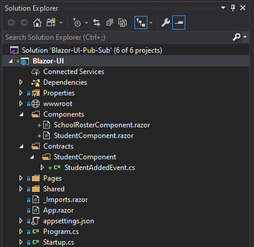
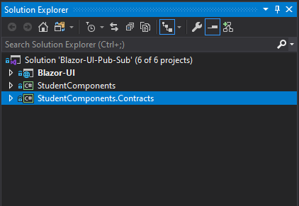

# BlazorComponentBus
Enables loosely coupled messaging between Blazor UI Components. Yes! Thats right! UI messaging with Blazor Server.

## Whats New
v1.2.0 - Breaking change. :-(
    I know. It sucks. But I modified the subscribe method so its less clumsy. If you are using a previous version you will need to update your calls where components subscribe to specific message types. Its a simple change and will be much cleaner. See the section _Subscribe to a message type_ below for the update.

## Full Working Example
For a full working example of using Blazor Component Bus (with source code) check out this Article on [Blazor UI Composition](https://clearmeasure.com/blazor-ui-composition/).

## Install BlazorComponentBus

Install the [BlazorComponentBus](https://www.nuget.org/packages/BlazorComponentBus) nuget package to your Blazor Server project.
    
    Install-Package BlazorComponentBus

Or via the .NET Core command line interface:

    dotnet add package BlazorComponentBus

Either commands, from Package Manager Console or .NET Core CLI, will download and install Blazor Component Bus.

## Setup
In your .NET Core app add the following line to make the ComponentBus available for use in your code.

    public void ConfigureServices(IServiceCollection services)
    {
        ...
        services.AddScoped<ComponentBus>();
    }

Next you will need to create message types. These are simple class files that can contain properties for passing information along to and from each component. The classes/objects are the messages that will be sent. The messages are the contracts that can be referenced by the components. The best practice is to create a contracts or messages folder for containg messages your component will emit.

An alternative approach would be to put your components and message contracts into separate projects. I prefer this approach especially if your components are in their own projects.

An example message might look like this:

    public class StudentAddedEvent
    {
        public Guid StudentId { get; set; }
    }

## Subscribe to a message type

Blazor Components you create can react to events that are submitted by subscribing to them. In the example above the **SchoollRosterComponent** would subscribe to the **StudentAddedEvent**. 

To subscribe to an event/message you must call Bus.Subscribe(). This will let the message broker know what type of message your blazor component is subscribed to and what to do when it gets one (execute a callback to the subscribing component). Pay attention to  _var message = args.GetMessage<StudentAddedEvent>();_. This is how you access data from the message itself.

    @inject BlazorComponentBus.ComponentBus Bus

    
Body of the SchoolRosterComponent

    
    @code
    {
        protected override void OnInitialized()
        {
            //Subscribe Component to Specific Message
            Bus.Subscribe<StudentAddedEvent>(StudentAddedHandler);
        }

        private void StudentAddedHandler(MessageArgs args)
        {
            var message = args.GetMessage<StudentAddedEvent>();

            var id = message.StudentId;

            ...Do Something
        }

    }

## Publish a message

To publish a message you must call the Bus.Publish() method and pass in the message you want to send. In the example above the **StudentComponent** might publish a **StudentAddedEvent** when a new student form was filled out.

    @inject BlazorComponentBus.ComponentBus Bus

    <h3>StudentComponent</h3>

    @code {

        public void SendItOutThere()
        {
            Bus.Publish(new StudentAddedEvent{StudentId = new Guid()});
        }
    }
